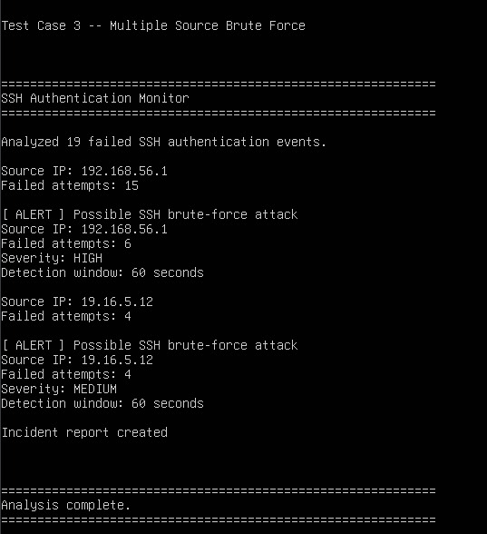
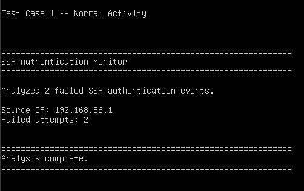
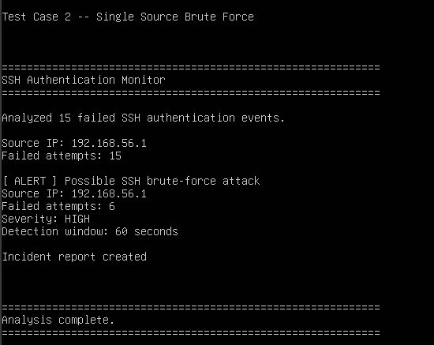
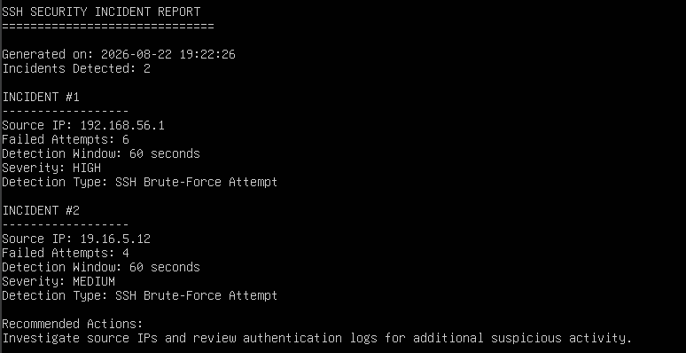

# SSH Authentication Monitor
A Python-based authentication monitoring tool that analyzes SSH authentication logs and detects potential brute-force attacks based on how many failed authentication attempts within a certain time window and creates a incident report if an issue is discovered

## Overview
This project was created as a cybersecurity project to practice network monitoring, log analysis, event detection, and incident reporting in Linux using Python

The program parses SSH authentication logs, finds the failed password entries, groups them by their source IP, analyses them within a 60 second time window, classifies the severity, and generates an incident report for the detected threats.

## Features
 - SSH authentication log parsing
 - Failed authentication detection
 - Aggregating failed attempts by IP
 - Time-window based brute-force detection
 - Classifying severity
 - Incident report generation
 - Test scenarios for normal activity, malicious activity from one source, and malicious activity from multiple sources

## Screenshots

## Limitations
This project is intended as a learning / portfolio project rather than a production SIEM. As a result, it only analyzes specific individual log files rather than continuously taking in logs from a logging platform

## Author
Jacob Anderson

Computer Science Grad interested in IT and cybersecurity.

https://www.linkedin.com/in/jacob-anderson-834886306/

jacobanderson.xyz
